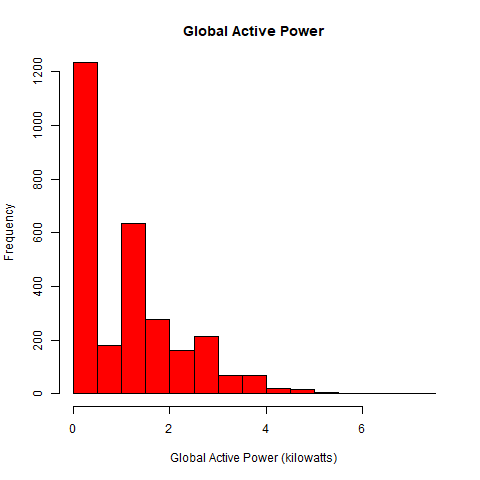
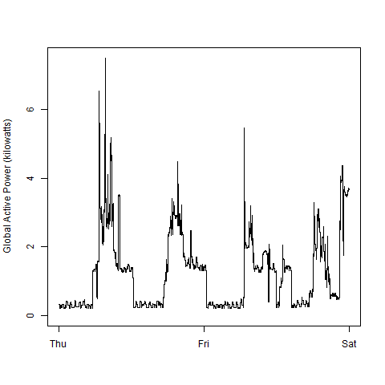
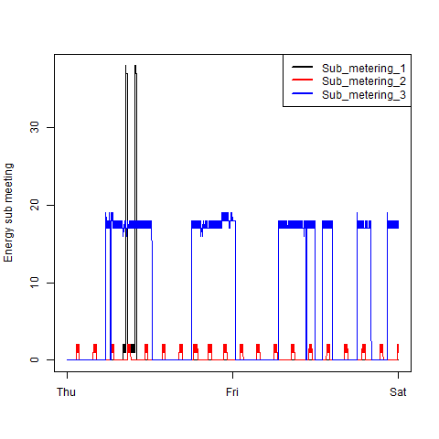
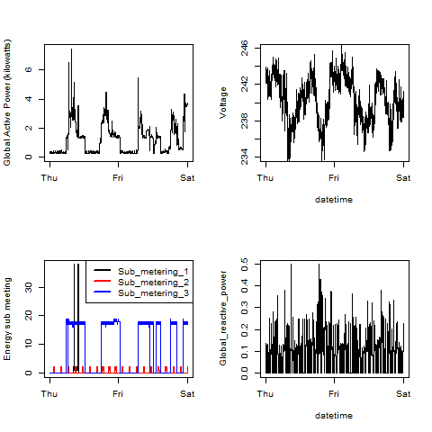

# Project 1 - Exploratory Data Analysis
This repository contains my submission for Project 1 in the Exploratory Data Analysis administered by Coursera. 

# What will you find here?
* Code - Codes used to produce each Figure are named as requested (plot1.R, plot2.R, plot3.R,plot4.R)
* Figures - All figures produced using these codes are included in *png* format.

# R Code
All R codes are also included in this repository. 

# Plots
Here, I include the plots I have produced. 

